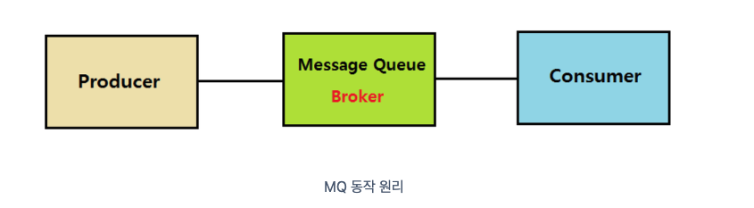
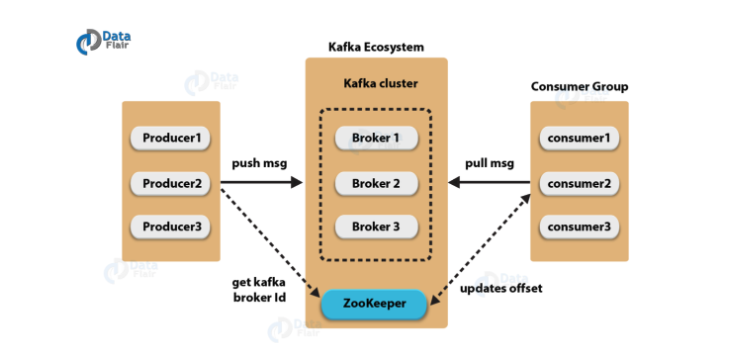
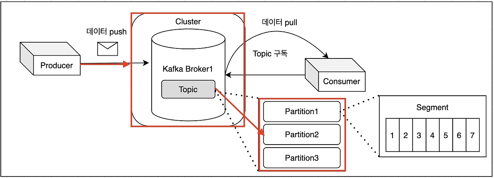
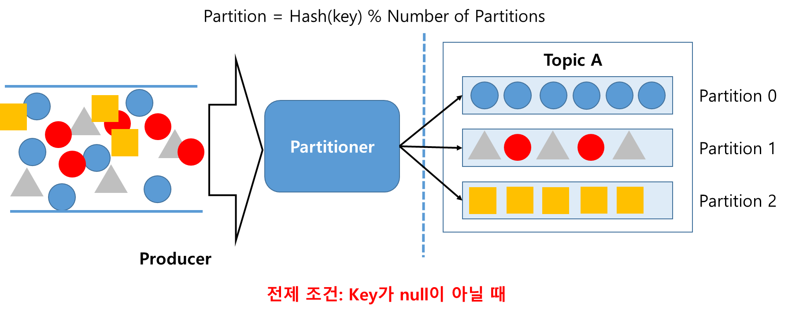
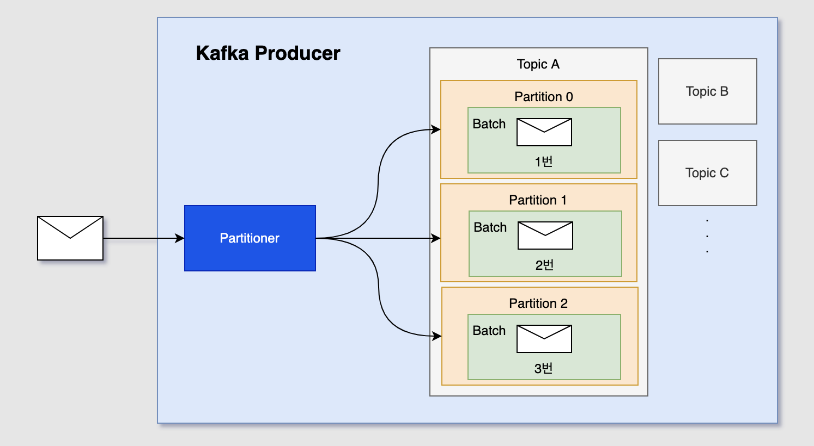
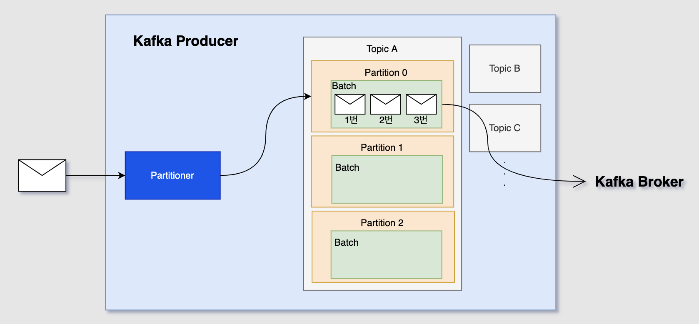
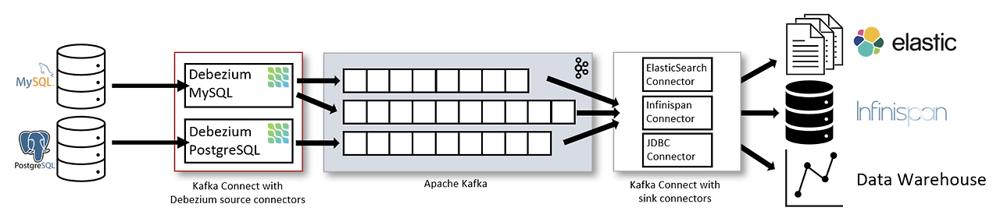

# Spring Kafka
- Spring Kafka를 사용하기 위한 학습용 레포지토리

## 학습 목표
- 프로세스간의 통신인 미들웨어 기반의 메세지 큐를 이해하고, Apache Kafka에 대한 구조와 Spring Kafka사용법에 대해 학습

## Spring Kafka란?

[출처 : https://spring.io/projects/spring-kafka]  

- Apache Kafka용 Spring프로젝트는 핵심 Spring 개념을 Kafka 기반 메시징 솔루션 개발에 적용합니다. 메시지를 보내기 위한 상위 수준 추상화로 템플릿을 제공합니다. 또한 @KafkaListener주석과 리스너 컨테이너가 있는 메시지 기반 POJO에 대한 지원도 제공합니다.

## Apache Kafka란?
- 카프카(Kafka)는 파이프라인, 스트리밍 분석, 데이터 통합 및 미션 크리티컬 애플리케이션을 위해 설계된 고성능 분산 이벤트 스트리밍 플랫폼이다. Pub-Sub 모델의 메시지 큐 형태로 동작하며 분산환경에 특화되어 있다.

## 미들웨어 / 메세지큐
- 메시지 큐는 메시지 지향 미들웨어(MOM : Message Oriented Middleware)를 구현한 시스템으로 프로그램(프로세스) 간의 데이터를 교환할 때 사용하는 기술이다.

[출처 : https://velog.io/@holicme7/Apache-Kafka-%EC%B9%B4%ED%94%84%EC%B9%B4%EB%9E%80-%EB%AC%B4%EC%97%87%EC%9D%B8%EA%B0%80]

  

## Apache Kafka구조
[출처 : https://velog.io/@holicme7/Apache-Kafka-%EC%B9%B4%ED%94%84%EC%B9%B4%EB%9E%80-%EB%AC%B4%EC%97%87%EC%9D%B8%EA%B0%80]

  

[출처 : https://curiousjinan.tistory.com/entry/kafka-producer-consumer-high-availability]

  
위 그림들처럼 Producer(데이터 전송자)가 Kafka Cluster의 구성요소중 하나인 Zookeepr에게 BrokerId를 요청받고 해당 Broker의 Topic에 데이터를 Push한다.(정확하게는 Topic에 Partition쪽에 데이터를 Push) 이후 Consumer는 해당 Topic에 데이터가 Push된걸 감지하여 데이터를 읽어들인다.

## Partitioner

[출처 : https://velog.io/@s2moon98/Kafka-%EB%82%B4%EB%B6%80-%EB%8F%99%EC%9E%91-%EB%8D%94-%EC%9E%90%EC%84%B8%ED%9E%88-%EB%B3%B4%EA%B8%B0-Producer]

- 토픽은 여러 개의 파티션으로 나뉘고 프로듀서가 전송한 메시지는 토픽 내부의 파티션의 로그 세그먼트에 저장된다. 메시지를 토픽의 어느 파티션으로 전송할 지 결정할 때 사용하는 것이 파티셔너이다. 파티셔너는 보통 키의 값에 따라서 메시지를 전송할 파티션을 선택한다. 하지만 메시지의 키는 필수값이 아니고 키 값이 null일 경우에는 여러 알고리즘을 이용해서 메시지를 분배한다.  
  
  [출처 : https://velog.io/@kidae92/Apache-Kafka-%EC%A3%BC%EC%9A%94-%EC%9A%94%EC%86%8C3]  
  위 그림처럼 Kafka에서는 Producer가 데이터를 Push하게 되면 Partitioner라는것을 통해 데이터가 Partition에 할당이 되는데 개발자가 Partitioner에 대한 정의를 따로 하지 않으면 DefaultPartitioner가 적용된다. DefaultPartitioner는 총 2가지있으며, 각각에 대한 설명은 아래 내용과 같다. (사용자가 따로 지정할경우 CustomPartitioner형태로 사용자가 구성한 형태로 Partition에 저장됨.)

- 라운드 로빈
  
메시지를 파티션 여러개들에게 순서대로 하나씩 할당하는 방법. 하지만 배치 사이즈가 채워지기 전까지 메시지들이 브로커의 토픽으로 전송되지 못하고 대기해야 한다는 단점이 있다.
위 그림에서 배치 사이즈를 3으로 설정했다면 파티션이 한개라면 이미 전송이 됐겠지만 하나씩 분배되어 할당됐기 때문에 전송이 일어나지 못했다. 이건 곧 지연 시간의 증가를 의미한다.

- 스티키 파티셔닝
  
라운드 로빈의 지연 시간 증가 이슈를 해결하기 위해서 등장한 방식으로 하나의 파티션에 레코드 수를 먼저 채워서 카프카 브로커로 빠르게 배치 전송하는 전략이다.
그림을 라운드 로빈과 비교해서 봤을 때 라운드 로빈에서는 3번 메세지까지 받고도 전송이 일어나지 못했지만 스티키 파티셔닝에서는 배치 사이즈인 3을 채워서 전송이 일어난다.

## Spring Kafka구조
[출처 : https://dzone.com/articles/synchronous-kafka-using-spring-request-reply-1]  
  
위 그림처럼 브라우저에서 데이터를 요청하면 Spring 애플리케이션의 Controller에서 Producer가 KafkaTemplate을 통해 Kafka에 데이터를 Topic에 Push하고 Consumer는 KafkaListener를 통해 해당 Topic의 데이터를 읽어들인다.

## Kafka Connect란?
- 먼저 Kafka는 Producer와 Consumer를 통해 데이터 파이프라인을 만들 수 있다. 예를 들어 A서버의 DB에 저장한 데이터를 Kafka Producer/Consumer를 통해 B서버의 DB로도 보낼 수 있다. 이러한 파이프라인이 여러개면 매번 반복적으로 파이프라인을 구성해야줘야한다. KafkConnect는 이러한 반복적인 파이프라인 구성을 쉽고 간편하게 만들 수 있게 만들어진 Apache Kafka 프로젝트중 하나다.  
  
  [출처 : https://cjw-awdsd.tistory.com/53]  
  
  
  위 사진을 보면 Kafka Connect를 이용해 왼쪽의 DB의 데이터를 Connect와 Source Connector를 사용해 Kafka Broker로 보내고 Connect와 Sink Connector를 사용해 Kafka에 담긴 데이터를 DB에 저장하는 것을 알 수 있다.  
    
    Connect: Connector를 동작하게 하는 프로세서(서버)  
Connector:  Data Source(DB)의 데이터를 처리하는 소스가 들어있는 jar파일  
Source Connector: data source에 담긴 데이터를 topic에 담는 역할(Producer)을 하는 connector  
Sink Connector: topic에 담긴 데이터를 특정 data source로 보내는 역할(Consumer 역할)을 하는   connector

## Source & Sink Connector 사용법
- Source Connector
```
{
    "name": "source-connect",
    "config": {
        "connector.class": "io.confluent.connect.jdbc.JdbcSourceConnector",
        "connection.url": "jdbc:mysql://localhost:3306/test",   #DB접속 URL
        "connection.user":"root",                               #접속할 ID
        "connection.password":"비밀번호",                        #접속할 ID의 비밀번호
        "mode":"incrementing",
        "incrementing.column.name" : "id",                      #incrementing mode일 때 자동 증가 column 이름
        "table.whitelist" : "users",                            #데이터를 변경을 감지할 table 이름
        "topic.prefix" : "example_topic_",                      # kafka 토픽에 저장될 이름 형식 지정 위 같은경우 whitelist를 뒤에 붙여 example_topic_users에 데이터가 들어감
        "tasks.max" : "1",
    }
}
cUrl -X POST -d @- http://localhost:8083/connectors --header "content-Type:application/json"
```

- Sink Connector
```
{
    "name": "sink-connect",
    "config": {
        "connector.class": "io.confluent.connect.jdbc.JdbcSinkConnector",
        "connection.url": "jdbc:mysql://localhost:3306/test",       #DB접속 URL
        "connection.user":"root",                                   #접속할 ID
        "connection.password":"비밀번호",                            #접속할 ID의 비밀번호
        "auto.create":"true",
        "auto.evolve":"true",
        "delete.enabled":"false",
        "tasks.max":"1",
        "topics":"example_topic_users"                              #sink할 토픽 및 DB에 저장할 Table
    }
}

cUrl -X POST -d @- http://localhost:8083/connectors --header "content-Type:application/json"
```

## 브렌치 설명
 - pub
    * Producer가 데이터를 Push하기 위한 애플리케이션
 - comsum
    * Comsumer가 데이터를 Pull하기 위한 애플리케이션
 - docker
    * Kafka를 Docker형태로 구성